# DockerCompose × (Airflow + MySQl + Streamlit)
El proyecto que consiste en realizar un ETL en Airflow, que almacenará los datos en una base de datos MySQL que posteriormente será leída por Python para realizar un dashboard interactivo en Streamlit sobre los casos de Coronavirus.

Streamlit             |  Airflow  | MySQL
:-------------------------:|:-------------------------:|:-------------------------:|
 |    |  
## Descripción

El proyecto consiste en un ETL que toma tres archivos en formato CSV, los inserta en la base de datos de MySQL, y utilizando las tablas generadas, se hace un Dashboard en Streamlit que permite la correcta visualización e interpretación de la data.
Todo es realizado en un docker-compose para facilitar la comunicación entre los distintos servicios.

## Herramientas

### Instalación | Herramientas

### Uso | Herramientas

# Instrucciones para correr el código

Primero, descarga este código. Recuerda que el proyecto fue hecho en Docker Toolbox, así que ten en mente esto al tratar temas de compatibilidad.

## Docker

Hacer cd a la carpeta frontend
> cd frontend

Luego crear la imagen 
> docker build -f Dockerfile -t app:latest .

Después volver a la carpeta original
> cd ..

Y allí hacer el docker-compose
> docker-compose up

## Airflow

Tras levantar los servicios espera unos instantes y aparecerá el dashboard principal.
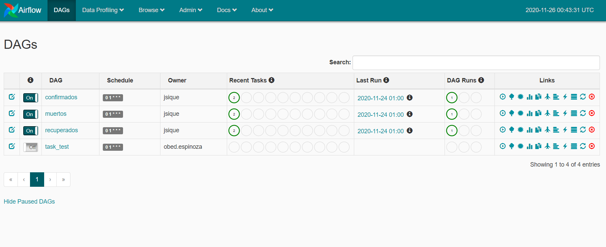

Luego, deberás de crear las conexiones respectivas, para ello ve a la pestaña correspondiente en *Administración* y haz clic en crear una conexión.

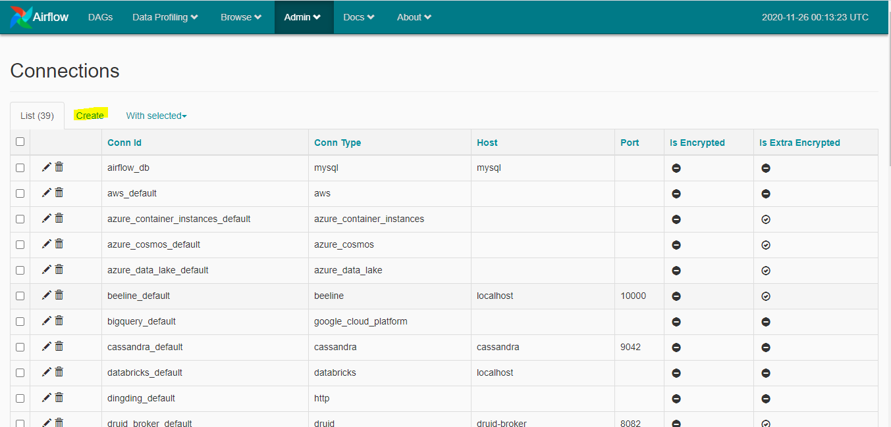

Haz las dos conexiones respectivas usando los siguientes datos: 
### Monitor File
Sirve para verificar cuando un archivo se pone en la carpeta de destino.

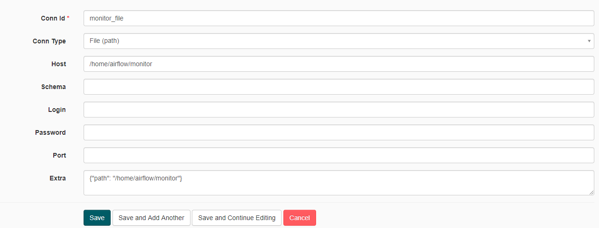

### SQL Connection
Sirve para conectar Airflow con MySQL.

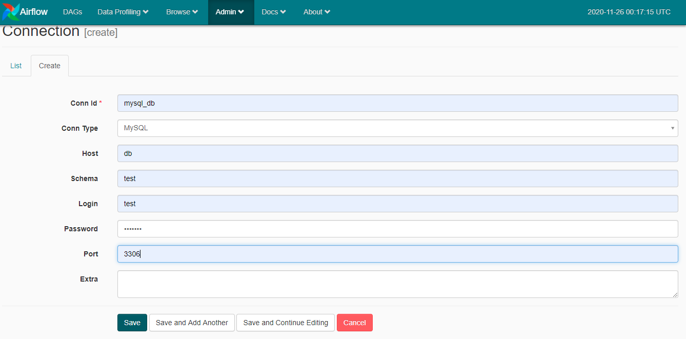

Con esto ya podrás dar inicio a las tareas *DAG* para que hagan su trabajo.

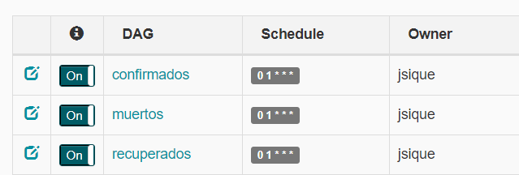

Al terminar su trabajo mostrarán un cículo verde oscuro.

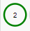

## Streamlit
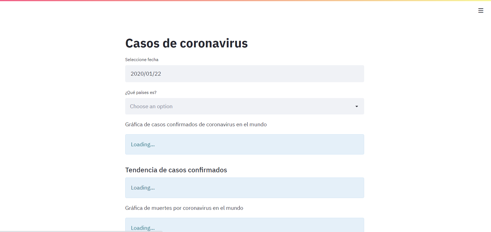

En el Dashboard se pueden apreciar las imágenes de mapas a los que se les puede aplicar filtros.
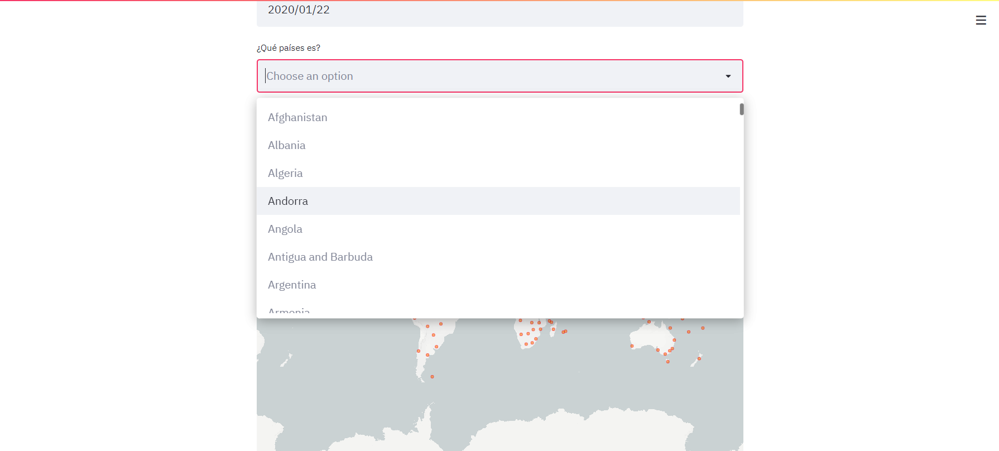

El proceso puede tardar, para ello muestra un icóno así en la parte superior

Luego de interactuar con filtros podemos ver que el mapa se actualizará.
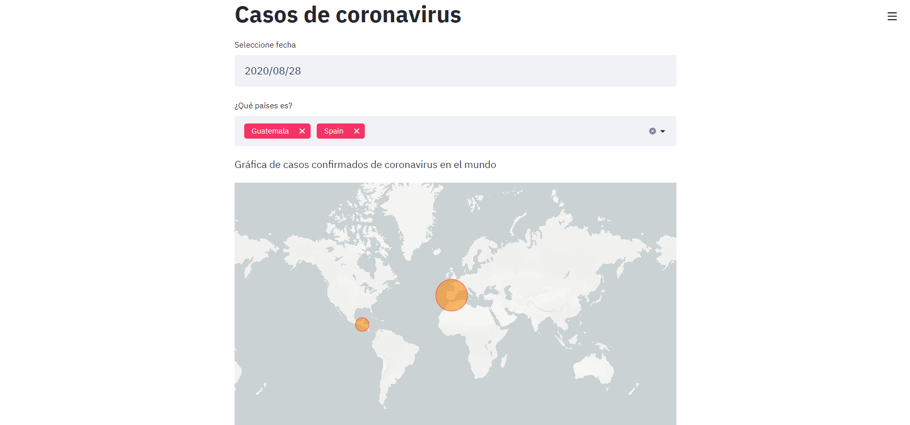

También habrá una tendencia para comparar los países seleccionados.
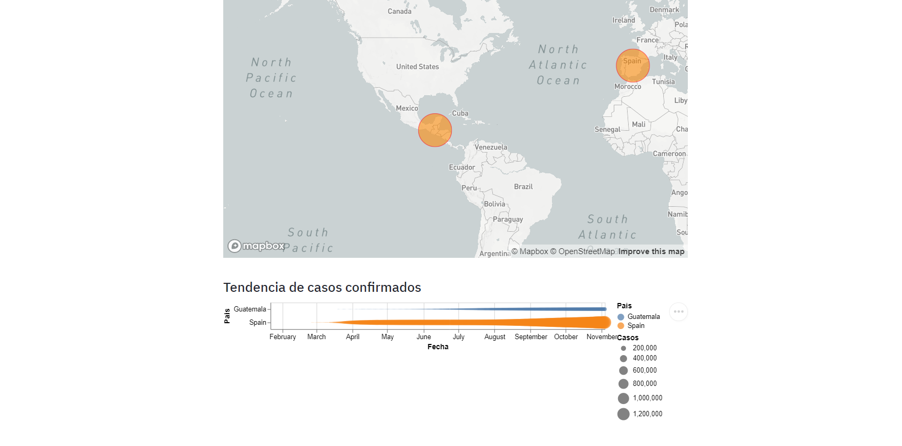

Por último hay un mapa que muestra la relación de recuperados contra fallecidos usando esferas.
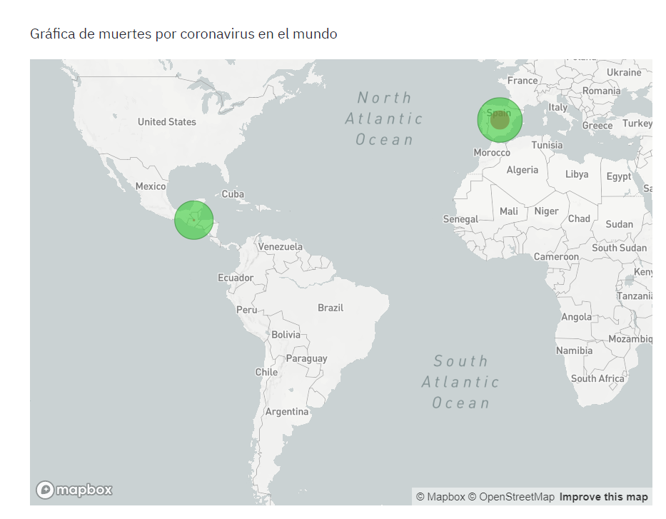

## ¿Qué sucede si hay un error con mis DAGS?
Si no se ejecutan ve y revisa las conexiones probablmente aparezca un error así.
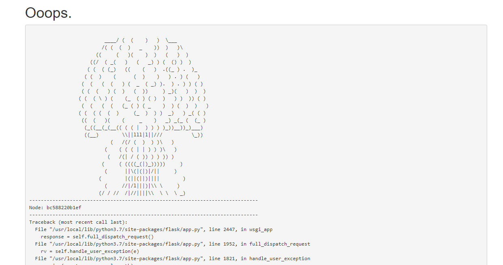

Para solucionarlo ve a conexiones, bórrala y vuelvela a crear.
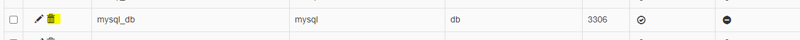
